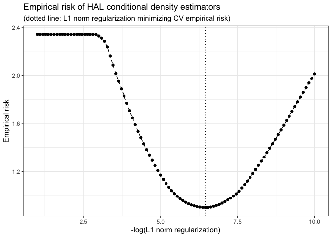

<!-- README.md is generated from README.Rmd. Please edit that file -->

# R/`haldensify`

<!-- badges: start -->

[](https://github.com/nhejazi/haldensify/actions)
[](https://codecov.io/github/nhejazi/haldensify?branch=master)
[](https://www.r-pkg.org/pkg/haldensify)
[](https://CRAN.R-project.org/package=haldensify)
[](https://CRAN.R-project.org/package=haldensify)
[](https://www.repostatus.org/#active)
[](https://opensource.org/licenses/MIT)
[](https://doi.org/10.5281/zenodo.3698329)
[](https://doi.org/10.21105/joss.04522)
<!-- badges: end -->

> Highly Adaptive Lasso Conditional Density Estimation

**Authors:** [Nima Hejazi](https://nimahejazi.org), [David
Benkeser](https://www.sph.emory.edu/faculty/profile/#!dbenkes), and
[Mark van der Laan](https://vanderlaan-lab.org/about/)

------------------------------------------------------------------------

## What’s `haldensify`?

The `haldensify` R package is designed to provide facilities for
nonparametric conditional density estimation based on a flexible
procedure proposed initially by Dı́az and van der Laan (2011). The core
of the implemented methodology involves recovering conditional density
estimates by performing pooled hazards regressions so as to assess the
conditional hazard that an observed value falls in a given bin over the
(conditional) support of the variable of interest. Such conditional
density estimates are useful, for example, in causal inference problems
in which the *generalized propensity score* (for continuous-valued
exposures) must be estimated (Dı́az and van der Laan 2012, 2018; Dı́az and
Hejazi 2020). `haldensify` implements this conditional density
estimation strategy for use only with the highly adaptive lasso (HAL)
(Benkeser and van der Laan 2016; van der Laan 2017; van der Laan and
Benkeser 2018; Coyle et al. 2022; Hejazi, Coyle, and van der Laan 2020).
Since the generalized propensity score is a key ingredient in inverse
probability weighting (IPW) methods, `haldensify` builds on the advances
of Ertefaie, Hejazi, and van der Laan (2022) and Hejazi et al. (2022) to
provide non-parametric IPW estimators of the causal effects for
continuous treatments, which achieve the semi-parametric efficiency
bound by undersmoothing along a family of HAL conditional density
estimators.

------------------------------------------------------------------------

## Installation

For standard use, we recommend installing the package from
[CRAN](https://CRAN.R-project.org/package=haldensify) via

``` r
install.packages("haldensify")
```

To contribute, install the *development version* of `haldensify` from
GitHub via [`remotes`](https://CRAN.R-project.org/package=remotes):

``` r
remotes::install_github("nhejazi/haldensify")
```

------------------------------------------------------------------------

## Example

A simple example illustrates how `haldensify` may be used to train a
highly adaptive lasso model to obtain conditional density estimates:

``` r
library(haldensify)
#> haldensify v0.2.3: Highly Adaptive Lasso Conditional Density Estimation
set.seed(76924)

# simulate data: W ~ U[-4, 4] and A|W ~ N(mu = W, sd = 0.25)
n_train <- 100
w <- runif(n_train, -4, 4)
a <- rnorm(n_train, w, 0.25)

# HAL-based density estimate of A|W
haldensify_fit <- haldensify(
  A = a, W = w,
  n_bins = 10, grid_type = "equal_range",
  lambda_seq = exp(seq(-1, -10, length = 100)),
  # arguments passed to hal9001::fit_hal()
  max_degree = 3,
  reduce_basis = 1 / sqrt(n_train)
)
#> Warning in (function (X, Y, formula = NULL, X_unpenalized = NULL, max_degree = ifelse(ncol(X) >= : Some fit_control arguments are neither default nor glmnet/cv.glmnet arguments: n_folds; 
#> They will be removed from fit_control
haldensify_fit
#> HAL Conditional Density Estimation
#> Number of bins over support of A: 10
#> CV-selected lambda: 0.0016
#> Summary of fitted HAL:
#> Warning in summary.hal9001(x$hal_fit): Coefficients for many lambda exist --
#> Summarizing coefficients corresponding to minimum lambda.
#>          coef                                    term
#>         <num>                                  <char>
#>  1:  5.989688                             (Intercept)
#>  2: 10.498800                      [ I(bin_id >= 2) ]
#>  3: -9.673620                      [ I(W >= -3.353) ]
#>  4:  8.659440                      [ I(bin_id >= 6) ]
#>  5: -8.272041 [ I(bin_id >= 2) ] * [ I(W >= -2.371) ]
#>  6: -8.261273                      [ I(W >= -3.109) ]
#>  7:  8.054827                      [ I(bin_id >= 7) ]
#>  8:  8.013383                      [ I(bin_id >= 4) ]
#>  9:  8.001995                      [ I(bin_id >= 5) ]
#> 10: -7.649731                      [ I(W >= -2.157) ]
```

We can also visualize the empirical risk (with respect to density loss)
in terms of the solution path of the lasso regularization parameter:

``` r
plot(haldensify_fit)
```



Finally, we can obtain conditional density estimates from the trained
model on the training (or on new) data:

``` r
# use the built-in predict method to get predictions
pred_haldensify <- predict(haldensify_fit, new_A = a, new_W = w)
head(pred_haldensify)
#> [1] 0.2818730 0.5513780 0.4449961 0.5329549 0.8722028 0.6150810
```

For more details, check out the [package
vignette](https://codex.nimahejazi.org/haldensify/articles/intro_haldensify)
on the corresponding `pkgdown` site.

------------------------------------------------------------------------

## Issues

If you encounter any bugs or have any specific feature requests, please
[file an issue](https://github.com/nhejazi/haldensify/issues).

------------------------------------------------------------------------

## Contributions

Contributions are very welcome. Interested contributors should consult
our [contribution
guidelines](https://github.com/nhejazi/haldensify/blob/master/CONTRIBUTING.md)
prior to submitting a pull request.

------------------------------------------------------------------------

## Citation

After using the `haldensify` R package, please cite the following:

        @article{hejazi2022efficient,
          author = {Hejazi, Nima S and Benkeser, David and D{\'\i}az, Iv{\'a}n
            and {van der Laan}, Mark J},
          title = {Efficient estimation of modified treatment policy effects
            based on the generalized propensity score},
          year = {2022},
          journal = {},
          publisher = {},
          volume = {},
          number = {},
          pages = {},
          doi = {},
          url = {https://arxiv.org/abs/2205.05777}
        }

        @article{hejazi2022haldensify-joss,
          author = {Hejazi, Nima S and {van der Laan}, Mark J and Benkeser,
            David C},
          title = {{haldensify}: Highly adaptive lasso conditional density
            estimation in {R}},
          year  = {2022},
          doi = {10.21105/joss.04522},
          url = {https://doi.org/10.21105/joss.04522},
          journal = {Journal of Open Source Software},
          publisher = {The Open Journal}
        }

        @software{hejazi2022haldensify-rpkg,
          author = {Hejazi, Nima S and Benkeser, David C and {van der Laan},
            Mark J},
          title = {{haldensify}: Highly adaptive lasso conditional density
            estimation},
          year  = {2022},
          howpublished = {\url{https://github.com/nhejazi/haldensify}},
          doi = {10.5281/zenodo.3698329},
          url = {https://doi.org/10.5281/zenodo.3698329},
          note = {{R} package version 0.2.5}
        }

------------------------------------------------------------------------

## Related

- [R/`hal9001`](https://github.com/tlverse/hal9001) – The highly
  adaptive lasso estimator used internally to constructed conditional
  density estimates.

------------------------------------------------------------------------

## Funding

The development of this software was supported in part through grants
from the National Library of Medicine (award number [T32
LM012417](https://reporter.nih.gov/project-details/9248418)), the
National Institute of Allergy and Infectious Diseases (award number [R01
AI074345](https://reporter.nih.gov/project-details/9926564)) of the
National Institutes of Health, and the National Science Foundation
(award number [DMS
2102840](https://www.nsf.gov/awardsearch/showAward?AWD_ID=2102840)).

------------------------------------------------------------------------

## License

© 2019-2025 [Nima S. Hejazi](https://nimahejazi.org)

The contents of this repository are distributed under the MIT license.
See below for details:

    MIT License

    Copyright (c) 2019-2025 Nima S. Hejazi

    Permission is hereby granted, free of charge, to any person obtaining a copy
    of this software and associated documentation files (the "Software"), to deal
    in the Software without restriction, including without limitation the rights
    to use, copy, modify, merge, publish, distribute, sublicense, and/or sell
    copies of the Software, and to permit persons to whom the Software is
    furnished to do so, subject to the following conditions:

    The above copyright notice and this permission notice shall be included in all
    copies or substantial portions of the Software.

    THE SOFTWARE IS PROVIDED "AS IS", WITHOUT WARRANTY OF ANY KIND, EXPRESS OR
    IMPLIED, INCLUDING BUT NOT LIMITED TO THE WARRANTIES OF MERCHANTABILITY,
    FITNESS FOR A PARTICULAR PURPOSE AND NONINFRINGEMENT. IN NO EVENT SHALL THE
    AUTHORS OR COPYRIGHT HOLDERS BE LIABLE FOR ANY CLAIM, DAMAGES OR OTHER
    LIABILITY, WHETHER IN AN ACTION OF CONTRACT, TORT OR OTHERWISE, ARISING FROM,
    OUT OF OR IN CONNECTION WITH THE SOFTWARE OR THE USE OR OTHER DEALINGS IN THE
    SOFTWARE.

------------------------------------------------------------------------

## References

<div id="refs" class="references csl-bib-body hanging-indent"
entry-spacing="0">

<div id="ref-benkeser2016highly" class="csl-entry">

Benkeser, David, and Mark J van der Laan. 2016. “The Highly Adaptive
Lasso Estimator.” In *Proceedings of the International Conference on
Data Science and Advanced Analytics*, 2016:689. NIH Public Access.
<https://doi.org/10.1109/dsaa.2016.93>.

</div>

<div id="ref-coyle2022hal9001-rpkg" class="csl-entry">

Coyle, Jeremy R, Nima S Hejazi, Rachael V Phillips, Lars WP van der
Laan, and Mark J van der Laan. 2022.
*<span class="nocase">hal9001</span>: The Scalable Highly Adaptive
Lasso*. <https://doi.org/10.5281/zenodo.3558313>.

</div>

<div id="ref-diaz2020causal" class="csl-entry">

Dı́az, Iván, and Nima S Hejazi. 2020. “Causal Mediation Analysis for
Stochastic Interventions.” *Journal of the Royal Statistical Society:
Series B (Statistical Methodology)* 82 (3): 661–83.
<https://doi.org/10.1111/rssb.12362>.

</div>

<div id="ref-diaz2011super" class="csl-entry">

Dı́az, Iván, and Mark J van der Laan. 2011. “Super Learner Based
Conditional Density Estimation with Application to Marginal Structural
Models.” *International Journal of Biostatistics* 7 (1): 1–20.
<https://doi.org/10.2202/1557-4679.1356>.

</div>

<div id="ref-diaz2012population" class="csl-entry">

———. 2012. “Population Intervention Causal Effects Based on Stochastic
Interventions.” *Biometrics* 68 (2): 541–49.
<https://doi.org/10.1111/j.1541-0420.2011.01685.x>.

</div>

<div id="ref-diaz2018stochastic" class="csl-entry">

———. 2018. “Stochastic Treatment Regimes.” In *Targeted Learning in Data
Science: Causal Inference for Complex Longitudinal Studies*, 167–80.
Springer. <https://doi.org/10.1007/978-3-319-65304-4_14>.

</div>

<div id="ref-ertefaie2020nonparametric" class="csl-entry">

Ertefaie, Ashkan, Nima S Hejazi, and Mark J van der Laan. 2022.
“Nonparametric Inverse-Probability-Weighted Estimators Based on the
Highly Adaptive Lasso.” *Biometrics* (in press).
<https://doi.org/10.1111/biom.13719>.

</div>

<div id="ref-hejazi2022efficient" class="csl-entry">

Hejazi, Nima S, David Benkeser, Iván Dı́az, and Mark J van der Laan.
2022. “Efficient Estimation of Modified Treatment Policy Effects Based
on the Generalized Propensity Score.” *arXiv*.
<https://arxiv.org/abs/2205.05777>.

</div>

<div id="ref-hejazi2020hal9001-joss" class="csl-entry">

Hejazi, Nima S, Jeremy R Coyle, and Mark J van der Laan. 2020.
“<span class="nocase">hal9001</span>: Scalable Highly Adaptive Lasso
Regression in R.” *Journal of Open Source Software*.
<https://doi.org/10.21105/joss.02526>.

</div>

<div id="ref-vdl2017generally" class="csl-entry">

van der Laan, Mark J. 2017. “A Generally Efficient Targeted Minimum
Loss-Based Estimator Based on the Highly Adaptive Lasso.” *International
Journal of Biostatistics* 13 (2).
<https://doi.org/10.1515/ijb-2015-0097>.

</div>

<div id="ref-vdl2018highly" class="csl-entry">

van der Laan, Mark J, and David Benkeser. 2018. “Highly Adaptive Lasso
(HAL).” In *Targeted Learning in Data Science: Causal Inference for
Complex Longitudinal Studies*, 77–94. Springer.
<https://doi.org/10.1007/978-3-319-65304-4_6>.

</div>

</div>
