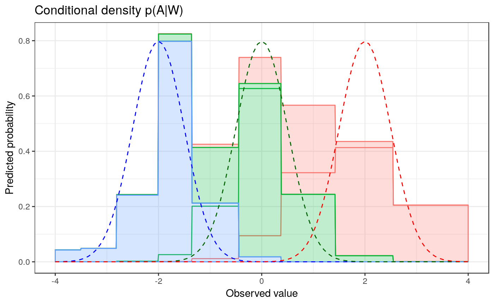

<!-- README.md is generated from README.Rmd. Please edit that file -->

# R/`haldensify`

[](https://travis-ci.org/nhejazi/haldensify)
[](https://ci.appveyor.com/project/nhejazi/haldensify)
[](https://codecov.io/github/nhejazi/haldensify?branch=master)
[](http://www.r-pkg.org/pkg/haldensify)
[](https://CRAN.R-project.org/package=haldensify)
[](https://www.repostatus.org/#wip)
[](http://opensource.org/licenses/MIT)

> Nonparametric Conditional Density Estimation with the Highly Adaptive
> Lasso

**Author:** [Nima Hejazi](https://nimahejazi.org)

-----

## What’s `haldensify`?

The `haldensify` R package is designed to provide facilities for
nonparametric conditional density estimation based on the procedure
proposed by Díaz and van der Laan (2011). The core of the implemented
methodology involves recovering conditional density estimates by
performing pooled hazards regressions so as to assess the conditional
hazard that an observation falls in a given bin over the support of the
variable of interest. Such conditional density estimates are required to
estimate the propensity score when the intervention variable considered
is continuous (Díaz and van der Laan 2012, @diaz2018stochastic,
@diaz2019causal). Though future generalization of the core routines may
be possible, for the time being, `haldensify` is a minimal
implementation of this strategy for use only with the highly adaptive
lasso (Benkeser and van der Laan 2016, @vdl2017generally,
@vdl2018highly, @coyle2018hal9001).

-----

## Installation

Install the most recent *stable release* from GitHub via
[`devtools`](https://www.rstudio.com/products/rpackages/devtools/):

``` r
devtools::install_github("nhejazi/haldensify")
```

-----

## Example

A simple example illustrates how `haldensify` may be used to construct
conditional density estimates:

``` r
library(data.table)
library(tidyverse)
library(hal9001)
library(haldensify)
set.seed(76924)

# simulate data: W ~ Rademacher and A|W ~ N(mu = \pm 1, sd = 0.5)
n_train <- 1000
w <- rbinom(n_train, 1, 0.5)
w[w == 0] <- -1
a <- rnorm(n_train, w, 0.5)

# learn relationship A|W using HAL-based density estimation procedure
mod_haldensify <- haldensify(
  A = a, W = w,
  grid_type = "equal_range",
  n_bins = 10,
  lambda_seq = exp(seq(-1, -13, length = 1000))
)

# predictions to recover conditional density of A|W
new_a <- seq(-2, 2, by = 0.01)
new_w_neg <- rep(-1, length(new_a))
new_w_pos <- rep(1, length(new_a))
new_dat <- as.data.table(list(a = new_a, w_neg = new_w_neg, w_pos = new_w_pos))
new_dat$pred_w_neg <- predict(mod_haldensify,
                              new_A = new_dat$a, new_W = new_dat$w_neg)
new_dat$pred_w_pos <- predict(mod_haldensify,
                              new_A = new_dat$a, new_W = new_dat$w_pos)
new_dat$true_w_neg <- dnorm(new_a, mean = unique(new_w_neg), sd = 0.5)
new_dat$true_w_pos <- dnorm(new_a, mean = unique(new_w_pos), sd = 0.5)

# visualize results
p <- new_dat %>%
  melt(id = c("a"), measure.vars = c("pred_w_pos", "pred_w_neg",
                                     "true_w_neg", "true_w_pos")) %>%
  mutate(
    variable = str_remove(variable, "pred_"),
    variable = str_remove(variable, "true_")
  ) %>%
  ggplot(aes(x = a, y = value, color = variable)) +
  geom_line() +
  xlab("Observed value") +
  ylab("Predicted probability") +
  ggtitle("Conditional density p(A|W)") +
  theme_bw() +
  theme(legend.position = "none")
p
```

<!-- -->

-----

## Issues

If you encounter any bugs or have any specific feature requests, please
[file an issue](https://github.com/nhejazi/haldensify/issues).

-----

## Contributions

Contributions are very welcome. Interested contributors should consult
our [contribution
guidelines](https://github.com/nhejazi/haldensify/blob/master/CONTRIBUTING.md)
prior to submitting a pull request.

-----

## Citation

After using the `haldensify` R package, please cite the following:

``` 
    @manual{hejazi2019haldensify,
      author = {Hejazi, Nima S},
      title = {haldensify: Nonparametric conditional density estimation
        with the highly adaptive lasso in {R}},
      year  = {2019},
      url = {https://github.com/nhejazi/haldensify},
      note = {R package version 0.0.1}
    }
```

-----

## Related

  - [R/`condensier`](https://github.com/osofr/condensier) - An
    independent implementation of the same core methodology, though more
    general in its making allowance for arbitrary selection of
    regression functions and a greater variety of hazard regression
    strategies.

-----

## License

© 2019 [Nima S. Hejazi](https://nimahejazi.org)

The contents of this repository are distributed under the MIT license.
See below for details:

    MIT License
    
    Copyright (c) 2019 Nima S. Hejazi
    
    Permission is hereby granted, free of charge, to any person obtaining a copy
    of this software and associated documentation files (the "Software"), to deal
    in the Software without restriction, including without limitation the rights
    to use, copy, modify, merge, publish, distribute, sublicense, and/or sell
    copies of the Software, and to permit persons to whom the Software is
    furnished to do so, subject to the following conditions:
    
    The above copyright notice and this permission notice shall be included in all
    copies or substantial portions of the Software.
    
    THE SOFTWARE IS PROVIDED "AS IS", WITHOUT WARRANTY OF ANY KIND, EXPRESS OR
    IMPLIED, INCLUDING BUT NOT LIMITED TO THE WARRANTIES OF MERCHANTABILITY,
    FITNESS FOR A PARTICULAR PURPOSE AND NONINFRINGEMENT. IN NO EVENT SHALL THE
    AUTHORS OR COPYRIGHT HOLDERS BE LIABLE FOR ANY CLAIM, DAMAGES OR OTHER
    LIABILITY, WHETHER IN AN ACTION OF CONTRACT, TORT OR OTHERWISE, ARISING FROM,
    OUT OF OR IN CONNECTION WITH THE SOFTWARE OR THE USE OR OTHER DEALINGS IN THE
    SOFTWARE.

-----

## References

<div id="refs" class="references">

<div id="ref-benkeser2016highly">

Benkeser, David, and Mark J van der Laan. 2016. “The Highly Adaptive
Lasso Estimator.” In *Proceedings of the International Conference on
Data Science and Advanced Analytics. IEEE International Conference on
Data Science and Advanced Analytics*, 2016:689. NIH Public Access.

</div>

<div id="ref-coyle2018hal9001">

Coyle, Jeremy R, and Nima S Hejazi. 2018. *hal9001: The Scalable Highly
Adaptive LASSO*. <https://github.com/tlverse/hal9001>.

</div>

<div id="ref-diaz2019causal">

Díaz, Iván, and Nima S Hejazi. 2019. “Causal Mediation Analysis for
Stochastic Interventions.” *Submitted*.
<https://arxiv.org/abs/1901.02776>.

</div>

<div id="ref-diaz2011super">

Díaz, Iván, and Mark J van der Laan. 2011. “Super Learner Based
Conditional Density Estimation with Application to Marginal Structural
Models.” *The International Journal of Biostatistics* 7 (1). De Gruyter:
1–20.

</div>

<div id="ref-diaz2012population">

———. 2012. “Population Intervention Causal Effects Based on Stochastic
Interventions.” *Biometrics* 68 (2). Wiley Online Library: 541–49.

</div>

<div id="ref-diaz2018stochastic">

———. 2018. “Stochastic Treatment Regimes.” In *Targeted Learning in Data
Science: Causal Inference for Complex Longitudinal Studies*, 167–80.
Springer Science & Business Media.

</div>

<div id="ref-vdl2017generally">

van der Laan, Mark J. 2017. “A Generally Efficient Targeted Minimum Loss
Based Estimator Based on the Highly Adaptive Lasso.” *The International
Journal of Biostatistics* 13 (2). De Gruyter.

</div>

<div id="ref-vdl2018highly">

van der Laan, Mark J, and David Benkeser. 2018. “Highly Adaptive Lasso
(Hal).” In *Targeted Learning in Data Science*, 77–94. Springer.

</div>

</div>
