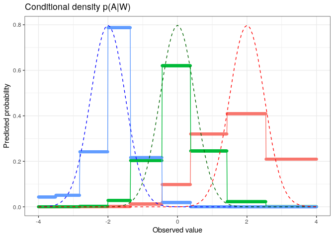

<!-- README.md is generated from README.Rmd. Please edit that file -->

# R/`haldensify`

[](https://travis-ci.org/nhejazi/haldensify)
[](https://ci.appveyor.com/project/nhejazi/haldensify)
[](https://codecov.io/github/nhejazi/haldensify?branch=master)
[](https://www.repostatus.org/#active)
[](http://opensource.org/licenses/MIT)
[](https://doi.org/10.5281/zenodo.3698329)

> Conditional Density Estimation with the Highly Adaptive Lasso

**Authors:** [Nima Hejazi](https://nimahejazi.org), [David
Benkeser](https://www.sph.emory.edu/faculty/profile/#!dbenkes), and
[Mark van der Laan](https://vanderlaan-lab.org/about/)

-----

## What’s `haldensify`?

The `haldensify` R package is designed to provide facilities for
nonparametric conditional density estimation based on the procedure
proposed by Díaz and van der Laan (2011). The core of the implemented
methodology involves recovering conditional density estimates by
performing pooled hazards regressions so as to assess the conditional
hazard that an observation falls in a given bin over the support of the
variable of interest. Such conditional density estimates are required to
estimate the propensity score when the intervention variable considered
is continuous (Díaz and van der Laan 2012, 2018; Díaz and Hejazi 2020).
Though future generalization of the core routines may be possible, for
the time being, `haldensify` is a minimal implementation of this
strategy for use only with the highly adaptive lasso (Benkeser and van
der Laan 2016; van der Laan 2017; van der Laan and Benkeser 2018; Coyle,
Hejazi, and van der Laan 2019).

-----

## Installation

Install the *most recent version* from the `master` branch on GitHub via
[`remotes`](https://CRAN.R-project.org/package=remotes):

``` r
remotes::install_github("nhejazi/haldensify")
```

-----

## Example

A simple example illustrates how `haldensify` may be used to construct
conditional density estimates:

``` r
library(tidyverse)
library(data.table)
library(haldensify)
set.seed(76924)

# simulate data: W ~ U[-4, 4] and A|W ~ N(mu = W, sd = 0.5)
n_train <- 100
w <- runif(n_train, -4, 4)
a <- rnorm(n_train, w, 0.5)

# learn relationship A|W using HAL-based density estimation procedure
mod_haldensify <- haldensify(
  A = a, W = w,
  n_bins = c(5, 10),
  lambda_seq = exp(seq(-1, -10, length = 300))
)

# predictions to recover conditional density of A|W
new_a <- seq(-4, 4, by = 0.1)
new_w_neg <- rep(-2, length(new_a))
new_w_zero <- rep(0, length(new_a))
new_w_pos <- rep(2, length(new_a))
new_dat <- as.data.table(list(a = new_a, w_neg = new_w_neg,
                              w_null = new_w_zero, w_pos = new_w_pos))
new_dat$pred_w_neg <- predict(mod_haldensify,
                              new_A = new_dat$a, new_W = new_dat$w_neg)
new_dat$pred_w_null <- predict(mod_haldensify,
                               new_A = new_dat$a, new_W = new_dat$w_null)
new_dat$pred_w_pos <- predict(mod_haldensify,
                              new_A = new_dat$a, new_W = new_dat$w_pos)

# visualize results
p <- new_dat %>%
  melt(id = c("a"), measure.vars =
       c("pred_w_pos", "pred_w_null", "pred_w_neg")) %>%
  ggplot(aes(x = a, y = value, colour = variable)) +
  geom_point() +
  geom_line() +
  stat_function(fun = dnorm, args = list(mean = -2, sd = 0.5),
                colour = "blue", linetype = "dashed") +
  stat_function(fun = dnorm, args = list(mean = 0, sd = 0.5),
                colour = "darkgreen", linetype = "dashed") +
  stat_function(fun = dnorm, args = list(mean = 2, sd = 0.5),
                colour = "red", linetype = "dashed") +
  xlab("Observed value") +
  ylab("Predicted probability") +
  ggtitle("Conditional density p(A|W)") +
  theme_bw() +
  theme(legend.position = "none")
p %>% print()
```

<!-- -->

-----

## Issues

If you encounter any bugs or have any specific feature requests, please
[file an issue](https://github.com/nhejazi/haldensify/issues).

-----

## Contributions

Contributions are very welcome. Interested contributors should consult
our [contribution
guidelines](https://github.com/nhejazi/haldensify/blob/master/CONTRIBUTING.md)
prior to submitting a pull request.

-----

## Citation

After using the `haldensify` R package, please cite the following:

``` 
    @manual{hejazi2020haldensify,
      author = {Hejazi, Nima S and Benkeser, David C and {van der Laan},
        Mark J},
      title = {{haldensify}: Conditional density estimation with the highly
        adaptive lasso},
      year  = {2020},
      howpublished = {\url{https://github.com/nhejazi/haldensify}},
      note = {{R} package version 0.0.5},
      url = {https://doi.org/10.5281/zenodo.3698329},
      doi = {10.5281/zenodo.3698329}
    }
```

-----

## Related

  - [R/`hal9001`](https://github.com/tlverse/hal9001) – The highly
    adaptive lasso estimator used internally to constructed conditional
    density estimates.
  - [R/`condensier`](https://github.com/osofr/condensier) – An
    independent implementation of some of the same core methodology,
    allowing for arbitrary selection of regression functions and a
    greater variety of hazard regression strategies.

-----

## License

© 2019-2020 [Nima S. Hejazi](https://nimahejazi.org)

The contents of this repository are distributed under the MIT license.
See below for details:

    MIT License
    
    Copyright (c) 2019-2020 Nima S. Hejazi
    
    Permission is hereby granted, free of charge, to any person obtaining a copy
    of this software and associated documentation files (the "Software"), to deal
    in the Software without restriction, including without limitation the rights
    to use, copy, modify, merge, publish, distribute, sublicense, and/or sell
    copies of the Software, and to permit persons to whom the Software is
    furnished to do so, subject to the following conditions:
    
    The above copyright notice and this permission notice shall be included in all
    copies or substantial portions of the Software.
    
    THE SOFTWARE IS PROVIDED "AS IS", WITHOUT WARRANTY OF ANY KIND, EXPRESS OR
    IMPLIED, INCLUDING BUT NOT LIMITED TO THE WARRANTIES OF MERCHANTABILITY,
    FITNESS FOR A PARTICULAR PURPOSE AND NONINFRINGEMENT. IN NO EVENT SHALL THE
    AUTHORS OR COPYRIGHT HOLDERS BE LIABLE FOR ANY CLAIM, DAMAGES OR OTHER
    LIABILITY, WHETHER IN AN ACTION OF CONTRACT, TORT OR OTHERWISE, ARISING FROM,
    OUT OF OR IN CONNECTION WITH THE SOFTWARE OR THE USE OR OTHER DEALINGS IN THE
    SOFTWARE.

-----

## References

<div id="refs" class="references">

<div id="ref-benkeser2016highly">

Benkeser, David, and Mark J van der Laan. 2016. “The Highly Adaptive
Lasso Estimator.” In *Proceedings of the International Conference on
Data Science and Advanced Analytics. IEEE International Conference on
Data Science and Advanced Analytics*, 2016:689. NIH Public Access.

</div>

<div id="ref-coyle2019hal9001">

Coyle, Jeremy R, Nima S Hejazi, and Mark J van der Laan. 2019. *hal9001:
The Scalable Highly Adaptive Lasso*.
<https://github.com/tlverse/hal9001>.
<https://doi.org/10.5281/zenodo.3558314>.

</div>

<div id="ref-diaz2020causal">

Díaz, Iván, and Nima S Hejazi. 2020. “Causal Mediation Analysis for
Stochastic Interventions.” *Journal of the Royal Statistical Society:
Series B (Statistical Methodology)*. Wiley Online Library.
<https://doi.org/10.1111/rssb.12362>.

</div>

<div id="ref-diaz2011super">

Díaz, Iván, and Mark J van der Laan. 2011. “Super Learner Based
Conditional Density Estimation with Application to Marginal Structural
Models.” *The International Journal of Biostatistics* 7 (1). De Gruyter:
1–20.

</div>

<div id="ref-diaz2012population">

———. 2012. “Population Intervention Causal Effects Based on Stochastic
Interventions.” *Biometrics* 68 (2). Wiley Online Library: 541–49.

</div>

<div id="ref-diaz2018stochastic">

———. 2018. “Stochastic Treatment Regimes.” In *Targeted Learning in Data
Science: Causal Inference for Complex Longitudinal Studies*, 167–80.
Springer Science & Business Media.

</div>

<div id="ref-vdl2017generally">

van der Laan, Mark J. 2017. “A Generally Efficient Targeted Minimum Loss
Based Estimator Based on the Highly Adaptive Lasso.” *The International
Journal of Biostatistics* 13 (2). De Gruyter.

</div>

<div id="ref-vdl2018highly">

van der Laan, Mark J, and David Benkeser. 2018. “Highly Adaptive Lasso
(HAL).” In *Targeted Learning in Data Science*, 77–94. Springer.

</div>

</div>
